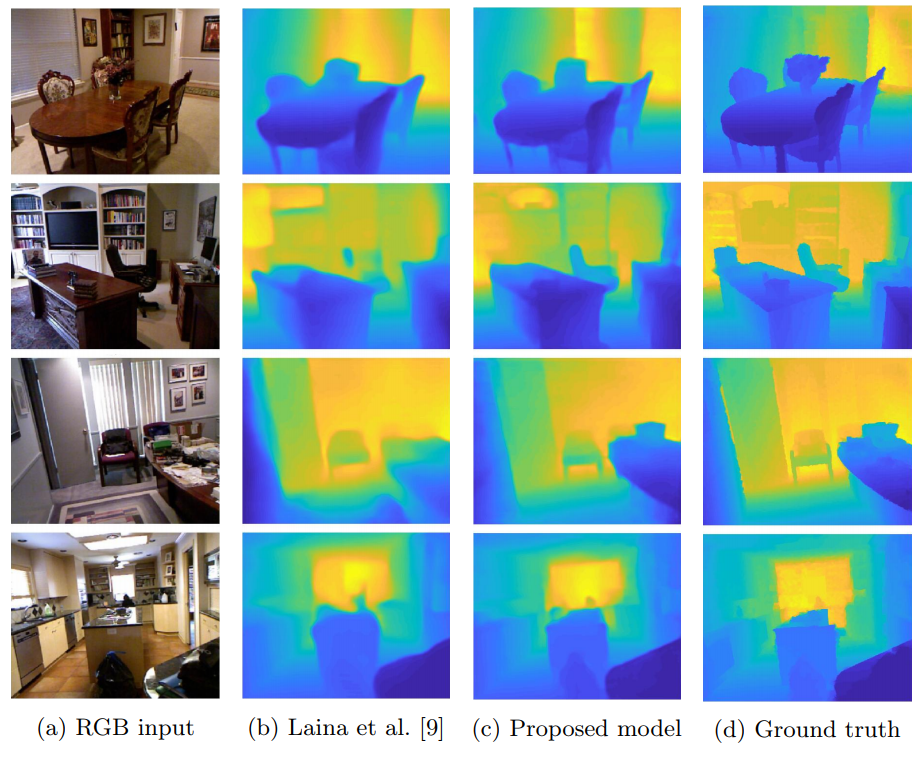

Hybrid CNN for Single Image Depth Estimation
============================================
This repository contains a CNN trained for single image depth estimation. The backbone of the architecture is the network from [Laina et. al](https://arxiv.org/abs/1606.00373), which we enhanced with Unet-like lateral connections to increase its accuracy. The network is trained on the [NYU Depth v2 dataset](https://cs.nyu.edu/~silberman/datasets/nyu_depth_v2.html). The repository also contains the code snippet we used for evaluation on test set of the NYU Depth v2 dataset, the test set itself (654 RGB images with their corresponding depth maps), and two short scripts for predicting the depth of RGB images and videos.


### Paper Describing the Approach:
[Károly Harsányi, Attila Kiss, András Majdik, Tamás Szirányi: 
A Hybrid CNN Approach for Single Image Depth Estimation: A Case Study.](https://link.springer.com/chapter/10.1007%2F978-3-319-98678-4_38)
IWCIM - 6th International Workshop on Computational Intelligence for Multimedia Understanding, 2018

### Requirements
The code was tested with:
- python 3.5 and 3.6
- pytorch (and torchvision) 0.4 to 1.0.0
- opencv-python 3.4.3
- matplotlib 2.2.3
- numpy 1.15.4


### Guide
- Evaluation on the NYU_depth_v2 test set:
```sh
python3 compute_errors.py
```
- Predicting the depth of an arbitrary image:
```sh
python3 predict_img.py <path_to_image>
```
- Predicting the depth from a video:
```sh
python3 predict_vid.py <path_to_video>
```

### Evalutation
- Quantitative results:
 
| REL  |  RMSE  | Log10 |  δ1 |  δ2 |  δ3 |
|:-----:|:-----:|:-----:|:-----:|:-----:|:-----:|
| 0.130 | 0.593 | 0.057 |0.833 |0.960 |0.989 |

- Qualitative results:



### Acknowledgments
The most of the code for the ResNet50 architecture comes from [pytorch/vision](https://github.com/pytorch/vision/blob/master/torchvision/models/resnet.py) and a few lines of code is borrowed from [FCRN-DepthPrediction](https://github.com/iro-cp/FCRN-DepthPrediction).


### Licence
Copyright 2018, Károly Harsányi

Redistribution and use in source and binary forms, with or without modification, are permitted provided that the following conditions are met:

1. Redistributions of source code must retain the above copyright notice, this list of conditions and the following disclaimer.
2. Redistributions in binary form must reproduce the above copyright notice, this list of conditions and the following disclaimer in the documentation and/or other materials provided with the distribution.

THIS SOFTWARE IS PROVIDED BY THE COPYRIGHT HOLDERS AND CONTRIBUTORS "AS IS" AND ANY EXPRESS OR IMPLIED WARRANTIES, INCLUDING, BUT NOT LIMITED TO, THE IMPLIED WARRANTIES OF MERCHANTABILITY AND FITNESS FOR A PARTICULAR PURPOSE ARE DISCLAIMED. IN NO EVENT SHALL THE COPYRIGHT HOLDER OR CONTRIBUTORS BE LIABLE FOR ANY DIRECT, INDIRECT, INCIDENTAL, SPECIAL, EXEMPLARY, OR CONSEQUENTIAL DAMAGES (INCLUDING, BUT NOT LIMITED TO, PROCUREMENT OF SUBSTITUTE GOODS OR SERVICES; LOSS OF USE, DATA, OR PROFITS; OR BUSINESS INTERRUPTION) HOWEVER CAUSED AND ON ANY THEORY OF LIABILITY, WHETHER IN CONTRACT, STRICT LIABILITY, OR TORT (INCLUDING NEGLIGENCE OR OTHERWISE) ARISING IN ANY WAY OUT OF THE USE OF THIS SOFTWARE, EVEN IF ADVISED OF THE POSSIBILITY OF SUCH DAMAGE.
